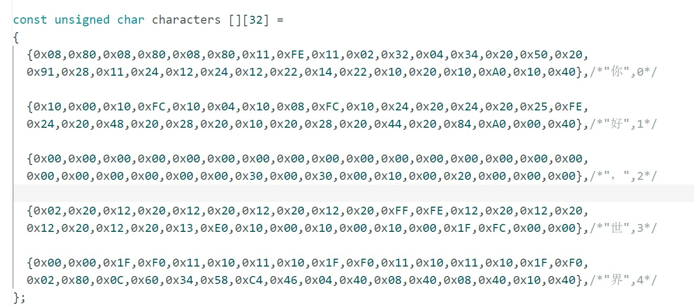
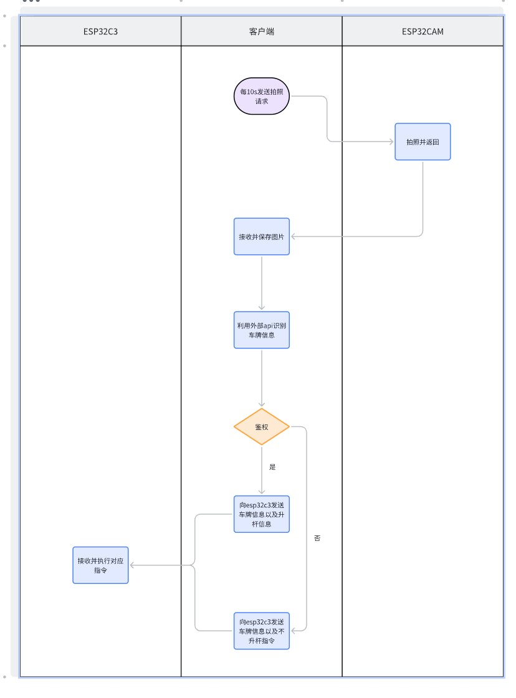

# 物联网暑期学习  

---  

## 自我介绍  

姓名：陈炜  

性格：  

敢于探索，积极自学，积极扩展专业的知识  

知识范围：  

1. 自学过网络协议的一些知识，了解==字节序==、==套接字==、==UDP协议==、==TCP协议==，使用c++编写过基于UDP、TCP协议的服务器端和客户端，实现同一网段下不同主机的通信  

2. 了解并使用过==docker==，理解==镜像==、==容器==相关概念，更改过更新docker的源，知道如何更改docker镜像源  

3. 了解==Linux==，现通过==WSL==使用Linux系统编程，网络协议相关的代码全部在Linux系统下书写，使用==vscode==远程连接ubuntu20.4  

4. 掌握==git==，理解分支概念，知道==版本冲突==的应对方式，上学期期末作业，和小组合作时，使用git管理代码合作  

5. 掌握==云服务器==的部分知识，知道使用==ssh==远程登陆云服务器，在阿里云上有一个服务器（可能快到期了）  

6. 了解==python==语言，掌握python的==虚拟环境==创建、启动、删除，知道利用==requirement文件==实现虚拟环境的重建  

7. 了解一部分==前端==知识，利用网页工具阅读==网页html文件==，找到需要的内容，利用==python写爬虫==批量爬取过豆瓣影评，并使用BeautifulSoup库解析html文件。理解访问网站的headers、cookie，使用网页工具（F12）下载过QQ音乐的VIP音乐  

8. 掌握一些pr技巧，剪辑过大一的心理剧，支教的总结视频  

9. 掌握==solidworks==零件和装配体的知识，自己制作了简易停车系统的外壳图纸（和商家每谈好，所以未在视频中体现，图纸已上传github仓库）  

---  

## arduinoIDE安装配置  

### 遇到的问题  

1.esp32开发板安装卡顿  

解决:源文件在github上，使用网络加速服务连接上  

2.安装后的开发板无法编译  

解决:将esp32开发板的版本回调，可以正常编译烧录  

---  

## esp32c3开发板学习  

### 学习内容

1. 点亮OLED屏幕  

2. 控制SG90舵机  

3. 测试esp32c3的AP和STA模式  

4. 尝试esp32c3与主机通信  

### OLED屏幕  

实验选用的OLED为==四针0.96英寸OLED显示屏==，采用I2C协议  

根据ESP32C3的I2C协议引脚，宏定义==时钟线(SLC)==，==数据线(SDA)==，初始化屏幕长度、宽度、频率，定义字符大小，颜色反色  

  

### SG90舵机  

两种启动方式:  

1.手动设置pwm电压控制舵机  

`
ledcSetup(CHANNEL, FREQ, RESOLUTION);
ledcAttachPin(LED, CHANNEL);`  

2.利用库函数直接输出pwm电压  

`
ESP32PWM::allocateTimer(1); //为舵机配置一个定时器（括号里的“1”是指一个定时器）;
  servo.setPeriodHertz(50); //设置频率;
  servo.attach(3, 500, 2500); //设置舵机最小脉冲宽度为500微秒， 最大为2500微秒, 同时绑定3号chip;
`  

### ESP32C3的AP和STA模式  

1.AP模式  

*接入点（AP）是一种提供 Wi-Fi 网络访问的设备，并将其连接到有线网络的装置。当ESP32单独处于AP模式下时，可以被认为是一个无法访问外网的==局域网WiFi路由器节点==，它可以接受各类设备的连接请求。并可以和连接设备进行TCP、UDP连接，实现数据流。在局域物联网的设计中可以承担数据收发节点的作用。*

调用==WiFi.h库==，将WiFi.mode调整为==AP模式==，设置ssid和密码启动AP模式  

2.STA模式  

*STA，连接外部wifi模式。在STA模式下，单片机可以连接外部wifi，和外部通信*  

调用==WiFi.h库==，将WiFi.mode调整为==STA模式==，设置ssid和密码启动STA模式(这里的ssid和密码为将要连接的WIFI的账户密码)。在连接wifi前，需要先扫描附近可用wifi，找到对应的wifi。  

### 设置服务器和主机通信  

*使用==Webserver.h库==创建服务器，使用==ArduinoJson.h库==解析来自主机的json数据*  

开启ESP32C3的STA模式，连接可用WiFi，同时确保主机和ESP32C3在==同一个局域网==中，创建web服务器，等待主机发送信息  

*位于同一个局域网中，使得通信双方位于==同一网段==(以前有学过一部分网络协议，使用c编写过简易TCP服务器和客户端)*  

### 遇到的问题  

1. 写的程序烧录到esp32c3上后无法运行  

解决:询问邱志颍学长后得知是==flashmode==的问题，调整flashmode为==dio==后程序可以在esp32c3上执行  

*IO12（GPIO12）、IO13（GPIO13）在QIO模式下为SPI信号SPIHD和SPIWP复用，为了增加可用GPIO数量，开发板选择采用2线SPI的DIO模式，IO12、IO13并未连接flash，使用自己编译的软件时需要注意配置flash为DIO模式。*  

  

2. OLED屏幕无法点亮  

解决:原先购买的OLED屏幕为==6针==，不知道怎么连接线路，I2C协议多了两个引脚，SPI协议少了一个引脚，后来更换为==4针==的OLED屏幕，采用==I2C协议==方式连接，成功点亮  

3. OLED默认字库没有中文  

解决:使用==PCtoLCD2002完美版==取模汉字，存入程序中，再像输出图片一样输出汉字  

  

  

---  

## esp32cam开发板的学习  

### 学习内容  

1. 使用烧录座烧录程序到esp32cam中  

2. 使用esp32cam示例程序，启动摄像头  

3. 在esp32cam上创建服务器，实现本地客户端向服务器发送拍照请求并返回拍到的照片  

### 安装对应驱动  

[参考教程](https://blog.csdn.net/qq_52525445/article/details/121665265)  

### esp32cam示例程序烧录检查硬件  

  

### 遇到的问题  

1. 无法通过烧录座向esp32cam烧录程序  

解决:缺少对应驱动，安装对应驱动后成功烧录程序  

  

2. 不知道如何启动摄像头  

解决:通过咨询邱志颍学长，学习提供的文档启动了摄像头，并找到的使用摄像头拍照的函数  

[https://randomnerdtutorials.com/esp32-cam-ov2640-camera-settings/](https://randomnerdtutorials.com/esp32-cam-ov2640-camera-settings/)  

  

3. 不知道如何返回OV260拍到的照片到本地的python客户端中  

解决:通过模范邱志颍学长提供的示例，成功将照片返回到本地的客户端  

  

---  

## 简易停车系统搭建  

### 学习内容  

1. 调用外部api识别车牌  

2. 将之前所学结合起来，搭建完整的简易停车系统  

### 系统搭建逻辑  

1. 以主机上的客户端为核心，每十秒向esp32cam发出拍照请求  

2. esp32cam处理来自客户端的拍照请求，拍照并返回  

3. 客户端利用api识别返回图片，提取车牌信息，进行鉴权操作  

4. 客户端将鉴权结果发送到esp32c3控制的摇杆系统中，在OLED屏幕上显示车牌，并根据鉴权结果决定是否将杆升起  

### 泳道图  

  

---  

## ESP32结构  

### CPU  

esp32有两个CPU，分别为==PRO_CPU==和==APP_CPU==，它们可以独立或协同工作。每个CPU都有一个哈佛架构的指令和数据总线，可以访问不同的内存空间。  

1. 主核（Pro-CPU）
主核是ESP32的高性能核心，基于RISC-V指令集架构。它具有较高的时钟频率和强大的计算能力，适合执行复杂和计算密集型的任务。在操作系统中，主核通常负责运行主线程、管理内存和处理器资源，以及执行那些需要高性能的任务。

2. 应用核（App-CPU）
应用核是ESP32的低功耗核心，同样基于RISC-V指令集架构。相比于主核，应用核的时钟频率较低，但功耗也相应地减少，使其非常适合执行轻量级和实时性要求较高的任务。应用核常用于运行应用程序的次要线程、处理中断和实时事件，以及执行一些低功耗模式下的任务。  

它们可以独立或协同工作。每个CPU都有一个哈佛架构的指令和数据总线，可以访问不同的内存空间。  

*==哈佛架构==：哈佛结构是一种将程序指令存储和数据存储分开的存储器结构，如下图所示。中央处理器首先到程序指令存储器中读取程序指令内容，解码后得到数据地址，再到相应的数据存储器中读取数据，并进行下一步的操作（通常是执行）。程序指令存储和数据存储分开，可以使指令和数据有不同的数据宽度。*  

*对比==冯诺依曼架构==，哈佛架构是将数据空间和地址空间分开，而冯则是数据空间和地址空间不分开*  

### 内存  

ESP32有多种类型的内存，包括==片上内存==和==片外内存==。  

1. 片上内存包括==ROM、SRAM和RTC Memory==，它们用于存储程序代码、数据和低功耗状态。  

2. 片外内存包括==Flash Memory和PSRAM==，它们用于扩展程序空间和数据空间。

---  

[github仓库地址](https://github.com/shuangxun12/IOT)  
